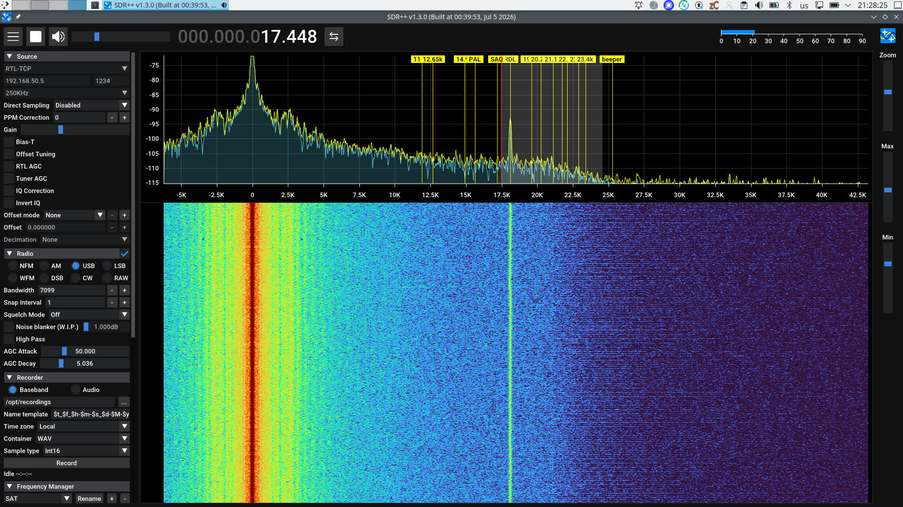

# Audio Streamer to RTL-TCP Emulator



Programa, skirta perduoti garso signalą tinklu (LAN, Wi-Fi, internetu) bei emuliuoti RTL-TCP protokolą, leidžiantį klausytis ir analizuoti VLF ar garso signalus naudojant SDR programinę įrangą.

## 📋 Apie projektą

Standartinė kompiuterio garso kortelė palaiko iki 48 kHz diskretizavimo dažnį (*sample rate*), kas pagal Nyquisto-Shenono teoremą leidžia priimti ir analizuoti signalus iki 24 kHz dažnio. Žemo elektromagnetinio triukšmo aplinkoje naudodami paprastą garso plokštę galite priimti VLF (*Very Low Frequency*) ruožo stotis, pavyzdžiui:

* **SAQ** (Grimeton) – 17.2 kHz
* **RDL** – 18.0 kHz
* **„Alpha“** navigacinės stotys (RSDN-20)

## ✨ Funkcijos

* **RTL-TCP emuliacija:** Perduoda garso plokštės signalą IP tinklu taip, tarsi tai būtų RTL-SDR imtuvas.
* **Tinklo palaikymas:** Veikia vietiniame tinkle (LAN/Wi-Fi) bei internetu.
* **Software Gain Control:** Programinis signalo stiprinimo reguliavimas imtuvo pusėje.

## ⚠️ Apribojimai ir ypatybės

* **Imties gylis (8-bit limitas):** RTL-TCP protokolas naudoja **8 bitų** imties gylį (*sample depth* / I/Q raišką). Nors kompiuterio garso kortelės palaiko žymiai didesnę raišką (16 bitų, 24 bitus ar daugiau) ir užtikrina platesnį dinaminį diapazoną, perduodant srautą per RTL-TCP emuliatorių signalas konvertuojamas į 8 bitus.

## 🔗 Suderinamumas

Programa emuliuoja standartinį RTL-TCP serverį, todėl yra suderinama su daugeliu populiarių SDR programų:

* **SDR++**
* **Gqrx**
* **OpenWebRX**

## 🚀 Įdiegimas ir paleidimas

### Reikalavimai

* Python 3.x
* Garso plokštė (įvesties įrenginys / mikrofono įėjimas)

### Paleidimo žingsniai

1. **Sukurkite ir aktyvuokite virtualią „Python“ aplinką:**

   ```bash
   python3 -m venv .venv
   source .venv/bin/activate
   ```

   *(Windows sistemoje aktyvavimui naudokite: `.venv\Scripts\activate`)*

2. **Įdiekite reikalingas priklausomybes:**

   ```bash
   pip install -r requirements.txt
   ```

3. **Paleiskite programą:**

   ```bash
   python3 rtl_tcp_emulator_soundcard_gainemu.py
   ```

Po paleidimo galite prisijungti iš savo SDR programinės įrangos nurodydami RTL-TCP serveryje IP adresą ir nustatytą prievadą (portą).

---
*Kodas ir dokumentacija sugeneruoti naudojant Gemini.*
